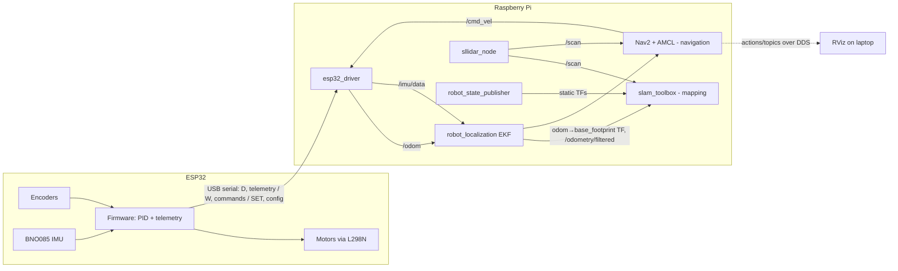
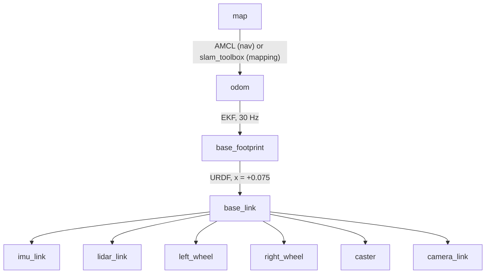

# AutoBot – ROS 2 Differential-Drive Robot (ESP32 + RPLidar A1 + BNO085 + Nav2)

A two-wheel differential-drive robot running **ROS 2 Jazzy** on a Raspberry Pi. An **ESP32** handles motor control, encoders and the IMU; the Pi runs the driver, sensor fusion (EKF), SLAM Toolbox for mapping and **Nav2** for autonomous navigation. RViz runs on a laptop.

This README explains every package and file in the workspace, how the pieces fit together, how to build, map and navigate, and (in a long section at the end) how to fix the problems that actually came up while bringing this robot up.

> **Note on versions.** The values quoted below (dimensions, parameter defaults, topic names) come from the workspace as reviewed. Your own YAML files may differ. If something in this README disagrees with your files, your files win – see [Troubleshooting → "Nav2 crashes / wrong YAML version"](#nav2-controller_server-crashes-with-exit-code--11-segfault).

---

## Table of contents

1. [What's in the robot](#1-whats-in-the-robot)
2. [System architecture](#2-system-architecture)
3. [Repository structure (every file explained)](#3-repository-structure-every-file-explained)
4. [Package: `my_robot_hardware` (ESP32 driver)](#4-package-my_robot_hardware-esp32-driver)
5. [Package: `my_robot_description` (URDF / TF)](#5-package-my_robot_description-urdf--tf)
6. [Package: `my_robot_bringup` (launch + configs)](#6-package-my_robot_bringup-launch--configs)
7. [Package: `sllidar_ros2` (RPLidar driver)](#7-package-sllidar_ros2-rplidar-driver)
8. [The `nav2_bringup` folder in `src/`](#8-the-nav2_bringup-folder-in-src)
9. [Coordinate frames and the TF tree](#9-coordinate-frames-and-the-tf-tree)
10. [Installation and build](#10-installation-and-build)
11. [Serial port setup (`/tmp/esp32_base`, `/tmp/rplidar`)](#11-serial-port-setup)
12. [Network setup (Pi + laptop)](#12-network-setup-pi--laptop)
13. [Calibration](#13-calibration)
14. [Workflow: map → save → navigate](#14-workflow-map--save--navigate)
15. [Nav2 parameter guide](#15-nav2-parameter-guide)
16. [Troubleshooting](#16-troubleshooting)
17. [Command cheat sheet](#17-command-cheat-sheet)
18. [Known limitations / next steps](#18-known-limitations--next-steps)
19. [Credits and licenses](#19-credits-and-licenses)

---

## 1. What's in the robot

| Part | Details |
|---|---|
| Computer | Raspberry Pi (Ubuntu, ROS 2 Jazzy) – runs driver, EKF, SLAM/Nav2 |
| Microcontroller | ESP32 – PID wheel-speed loops, encoder counting, IMU reading, USB serial to the Pi |
| Motor driver | L298N-style (ENA/IN1/IN2 = left, ENB/IN3/IN4 = right) |
| Encoders | Quadrature, 2 channels per wheel, 4× decoding (`ticks_per_rev ≈ 3272`) |
| IMU | BNO085 (orientation from the game rotation vector – no magnetometer by default, gyro, accelerometer) |
| Lidar | Slamtec RPLidar A1 (115200 baud, ~12 m range) |
| Laptop | Runs RViz only (same LAN, same `ROS_DOMAIN_ID`) |

Body: 0.30 m long × 0.235 m wide × 0.15 m high. Wheel radius 0.0425 m (driver) / 0.045 m (URDF visual), wheel separation ≈ 0.28 m. The drive wheels sit 0.075 m *behind* the body centre, with a caster at the front.

---

## 2. System architecture



Two modes, never at the same time:

| Mode | Localisation source of `map→odom` | Launch file |
|---|---|---|
| **Mapping** | `slam_toolbox` | `mapping_bringup.launch.py` |
| **Navigation** | Nav2 `amcl` on a saved map | `nav_bringup.launch.py` |

The data flow for driving:

`Nav2 planner/controller → /cmd_vel_nav → velocity_smoother → collision_monitor → /cmd_vel → esp32_driver → serial "W,left,right" → ESP32 PID → motors`

---

## 3. Repository structure (every file explained)

```
src/
├── my_robot_hardware/                  # Python package – the ESP32 driver
│   ├── my_robot_hardware/
│   │   ├── __init__.py                 # empty, marks the Python package
│   │   └── esp32_driver.py             # THE driver: serial protocol, odometry, IMU, cmd_vel shaping
│   ├── config/
│   │   └── robot_params.yaml           # every calibration/tuning value (loaded by the launch files)
│   ├── resource/my_robot_hardware      # ament index marker (required by ROS 2, leave empty)
│   ├── test/                           # ament lint tests (copyright, flake8, pep257)
│   ├── package.xml                     # dependencies and metadata
│   ├── setup.py                        # installs the node as `esp32_driver` and config/*.yaml
│   └── setup.cfg                       # install directories for the console script
│
├── my_robot_description/               # CMake package – robot model
│   ├── urdf/
│   │   ├── my_robot.urdf.xacro         # top-level file, includes the three files below
│   │   ├── common_properties.xacro     # shared colours/materials/macros
│   │   ├── mobile_base.xacro           # links + joints: body, wheels, caster, IMU, lidar, camera
│   │   └── mobile_base_gazebo.xacro    # Gazebo-only plugins/sensors (simulation)
│   ├── launch/
│   │   ├── display.launch.py           # starts robot_state_publisher (has a use_sim_time argument, default false)
│   │   └── display.launch.xml          # URDF viewer: RSP + joint_state_publisher_gui + RViz
│   ├── rviz/urdf_config.rviz           # RViz config for viewing the model
│   ├── params/my_robot_bridge.yaml     # ros_gz_bridge topic list (simulation only)
│   ├── worlds/tugbot_depot.sdf         # Gazebo world (simulation only)
│   ├── arduino_code/arduino_code.ino   # LEGACY micro-ROS firmware (not used with the current driver)
│   ├── CMakeLists.txt / package.xml
│
├── my_robot_bringup/                   # CMake package – launch files and configs
│   ├── launch/
│   │   ├── mapping_bringup.launch.py   # base stack + slam_toolbox (create a map)
│   │   ├── nav_bringup.launch.py       # base stack + Nav2 with a saved map (autonomous navigation)
│   │   ├── ekf_launch.launch.py        # robot_localization EKF (wheel odom + IMU)
│   │   ├── non_imu_ekf_launch.py       # EKF variant without the IMU (wheel odom only)
│   │   ├── rviz_launch.launch.py       # RViz + its own RSP/JSP – for a machine WITHOUT the robot stack
│   │   └── my_robot_gz.launch.py       # Gazebo simulation (mostly commented out)
│   ├── config/
│   │   ├── ekf.yaml                    # EKF: fuse /odom (vx, vyaw) + /imu/data (orientation, gyro)
│   │   ├── ekf_non_imu.yaml            # EKF config for the non-IMU variant
│   │   ├── slam_params.yaml            # slam_toolbox parameters for mapping
│   │   ├── nav2_params.yaml            # Nav2 parameters tuned for this robot
│   │   └── nav2_params_radius.yaml     # same as above but circular robot_radius (A/B test / fallback)
│   ├── CMakeLists.txt / package.xml    # installs launch/ and config/ into share/
│
├── sllidar_ros2/                       # Slamtec's official RPLidar driver (vendor code, mostly untouched)
│   ├── launch/sllidar_a1_launch.py     # launch file for the A1 (115200 baud)
│   ├── src/sllidar_node.cpp            # the ROS 2 node publishing /scan
│   ├── src/sllidar_client.cpp          # small test client that prints scans
│   ├── sdk/                            # Slamtec C++ SDK (protocol, serial channel, unpackers)
│   ├── scripts/                        # udev rule helpers (create/delete rplidar.rules)
│   └── LICENSE, README.md, *.png
│
└── nav2_bringup/                       # (if present) your local copy of Nav2's bringup package
```

**Recommended additions to the repo** (not in the tree above but worth committing):

| File | Purpose |
|---|---|
| `scripts/port_hunter.py` | Detects which `/dev/ttyUSB*` is the ESP32 and which is the lidar and creates `/tmp/esp32_base` and `/tmp/rplidar` (see [section 11](#11-serial-port-setup)) |
| `firmware/…` | The **current** ESP32 firmware (the one that speaks the `D,`/`I,`/`SET,`/`W,` protocol). `arduino_code.ino` in `my_robot_description` is the old micro-ROS version and is easy to confuse with it |
| `maps/` | Saved maps (`my_map.yaml` + `my_map.pgm`/`.png`) so navigation works after a fresh clone |

---

## 4. Package: `my_robot_hardware` (ESP32 driver)

### 4.1 What the driver does

`esp32_driver.py` is a single ROS 2 node (`/esp32_driver`). **All robot maths lives on the Pi**; the ESP32 firmware never has to be edited for tuning because the driver sends every firmware setting over serial at start-up (and again automatically if the ESP32 resets).

| Direction | Topic | Type | Notes |
|---|---|---|---|
| Subscribes | `/cmd_vel` | `geometry_msgs/Twist` | Uses `linear.x` and `angular.z` |
| Publishes | `/odom` | `nav_msgs/Odometry` | Frame `odom` → child `base_footprint`. Pose integrated from encoders, twist from encoder deltas |
| Publishes | `/imu/data` | `sensor_msgs/Imu` | Frame `imu_link`. Orientation quaternion, gyro (minus bias), accelerometer |

Important behaviours:

- **Command ramping.** `cmd_vel` is smoothed with `max_linear_accel`, `max_angular_accel`, `max_linear_decel`, `max_angular_decel`. Tiny speeds snap to zero (`vel_snap_*`).
- **Command watchdog.** If no `/cmd_vel` arrives for `cmd_timeout` (0.5 s) the robot is told to stop. The ESP32 has its own timeout (`fw_cmd_timeout_ms`).
- **Inverse kinematics** with per-wheel scale factors:
  `w_left = (v − ω·L/2) / (r · left_scale)`, `w_right = (v + ω·L/2) / (r · right_scale)`.
- **Odometry.** Per-tick distance = `2π·r / ticks_per_rev`, scaled by `left_scale`/`right_scale`, mid-point integration. It uses the ESP32's own microsecond clock for `dt`, so serial jitter does not add noise.
- **Sanity filters.** Telemetry with `dt ≤ 0` or `dt > max_dt`, or with a tick jump above `max_ticks_per_read`, is rejected (a warning is printed, at most every 2 s).
- **Covariances.** `/odom` pose and twist variances come from `cov_*` parameters. The sideways velocity variance (`twist.covariance[7]`) is fixed at `1e-3` – a differential drive cannot slide sideways, so it must never be zero.
- **Timestamps.** Messages are stamped with the Pi's clock when they arrive.

### 4.2 Serial protocol (Pi ⇄ ESP32, newline-terminated text, 115200 baud)

| Line | Direction | Meaning |
|---|---|---|
| `D,t_us,left_ticks,right_ticks,qx,qy,qz,qw,gx,gy,gz,ax,ay,az,flags,…` | ESP32 → Pi | 17 comma-separated fields. `flags` bit 0 = "firmware has received its configuration", bit 1 = "IMU sample valid" |
| `I,text` | ESP32 → Pi | Info message, printed by the driver as `[esp32] text` |
| `CFGBEGIN` / `SET,key,value` … / `CFGEND,count` | Pi → ESP32 | Configuration block. `count` lets the ESP32 detect a lost line; the driver resends every second until `flags` bit 0 is set |
| `SET,key,value` | Pi → ESP32 | Live change (sent immediately when you run `ros2 param set`) |
| `W,left_rad_s,right_rad_s` | Pi → ESP32 | Wheel speed targets, sent at `cmd_rate_hz` (50 Hz) |

Opening the serial port usually **resets the ESP32** (DTR toggling). That is expected – the driver reconfigures it automatically.

### 4.3 Parameters (`config/robot_params.yaml`)

Floats must contain a decimal point (`1.0`, not `1`).

| Group | Parameters | Meaning |
|---|---|---|
| Connection | `port` (`/tmp/esp32_base`), `baudrate` (115200) | Must match the firmware `BAUD` |
| Geometry / calibration | `wheel_radius` 0.0425, `wheel_separation` 0.28, `ticks_per_rev` 3272.0, `left_scale`, `right_scale` | Calibrate these ([section 13](#13-calibration)). `ticks_per_rev` is also pushed to the ESP32 |
| Wheel PID (runs on ESP32) | `kp_left/right` 40, `ki_left/right` 60, `kff_left/right` 0, `pwm_min`, `pwm_freq` 20000, `speed_lpf` 0.3, `idle_w` 0.05 | `pwm_min` compensates the motor dead zone; `idle_w` switches motors fully off below that speed to stop hum |
| Firmware timing | `fw_cmd_timeout_ms` 300, `telem_hz` 50 | Firmware watchdog and telemetry rate |
| Direction flips | `invert_left_motor`, `invert_right_motor`, `invert_left_encoder`, `invert_right_encoder` (right encoder = true) | Fix reversed wiring without re-flashing |
| IMU | `imu_source` (0 = no magnetometer, recommended near motors; 1 = with magnetometer), `gyro_bias_x/y/z` | Bias is subtracted from the gyro |
| Command shaping | `max_linear_accel` 1.5, `max_angular_accel` 2.0, `max_linear_decel` 1.5, `max_angular_decel` 5.0, `vel_snap_linear` 0.02, `vel_snap_angular` 0.05, `cmd_timeout` 0.5, `cmd_rate_hz` 50 | |
| Telemetry sanity | `max_dt` 0.5, `max_ticks_per_read` 8000, `encoder_noise_ticks` 2 | Noise dead-band applies only while commanded to stand still |
| Frames | `odom_frame` odom, `base_frame` base_footprint, `imu_frame` imu_link | Must match the URDF and EKF |
| Covariances | `cov_pos` 0.02, `cov_yaw` 0.05, `cov_vx` 0.02, `cov_wz` 0.05, `cov_imu_orient` 0.0025, `cov_imu_gyro` 0.0004, `cov_imu_accel` 0.0064 | Variances (not standard deviations) |

Live tuning:

```bash
ros2 param set /esp32_driver kp_left 30.0            # sent to the ESP32 immediately
ros2 param dump /esp32_driver > robot_params.yaml    # save what works
```

### 4.4 Running it

```bash
# with your calibration file
ros2 run my_robot_hardware esp32_driver --ros-args \
  --params-file $(ros2 pkg prefix my_robot_hardware)/share/my_robot_hardware/config/robot_params.yaml
```

The launch files start the driver for you. If the node is started **without** a params file it silently uses the built-in `DEFAULTS` dictionary – changes you make in `robot_params.yaml` have no effect until the file is actually passed to the node.

---

## 5. Package: `my_robot_description` (URDF / TF)

### 5.1 Robot geometry (from `mobile_base.xacro`)

| Property | Value |
|---|---|
| `base_length` × `base_width` × `base_height` | 0.30 × 0.235 × 0.15 m |
| `wheel_radius` (visual) / `wheel_length` | 0.045 / 0.04 m |
| Wheel joints | at x = −0.075 (−`base_length`/4), y = ±0.1375 relative to `base_link` – continuous joints |
| Caster | fixed joint at the front (x = +0.075) |
| IMU (`imu_link`) | (0, 0, 0.15), rpy = (0.033, 0.062, 0) – your measured tilt |
| Lidar (`lidar_link`) | (0.12, 0, 0.225), **yaw = π** (mounted rotated 180°) |
| Camera frames | (0.30, 0, 0.15) – present in the model, not used by the current navigation stack |

### 5.2 `base_footprint` is on the wheel axle

`base_joint` is defined as `base_footprint → base_link` with origin **x = +`base_length`/4**. That places `base_footprint` exactly on the midpoint of the wheel axle – the point a differential-drive robot rotates around and the point the wheel odometry tracks. If `base_footprint` were at the body centre instead, every in-place rotation would show up as the lidar "orbiting" by 7.5 cm and the map would smear.

### 5.3 Who publishes what

`robot_state_publisher` (started by `display.launch.py`) is the **only** publisher of the URDF's fixed transforms: `base_footprint→base_link`, `base_link→imu_link`, `base_link→lidar_link`, wheels, caster, camera. Do **not** add extra `static_transform_publisher` nodes for these – two publishers with different values makes TF flip between them (see [Troubleshooting](#tf-conflicts--smeared-map)).

`joint_state_publisher` provides values for the two continuous wheel joints so their TFs exist (the wheels are only cosmetic in RViz).

### 5.4 Simulation-only and legacy files

- `mobile_base_gazebo.xacro`, `params/my_robot_bridge.yaml`, `worlds/tugbot_depot.sdf` and `my_robot_gz.launch.py` are for Gazebo. The Gazebo xacro uses a `laser` frame name; the real robot uses `lidar_link`.
- `arduino_code/arduino_code.ino` is the **old micro-ROS** firmware (wheel radius 0.1, separation 0.3, 1× decoding). It does **not** speak the serial protocol above. Make sure it is not what is flashed on the robot.

---

## 6. Package: `my_robot_bringup` (launch + configs)

### 6.1 Launch files

| File | What it starts | When to use |
|---|---|---|
| `mapping_bringup.launch.py` | `display.launch.py` (RSP), `joint_state_publisher`, `esp32_driver` (with `robot_params.yaml`), `sllidar_a1_launch.py`, `ekf_launch.launch.py`, `slam_toolbox` (real time + `slam_params.yaml`) | Building a new map |
| `nav_bringup.launch.py` | RSP, `joint_state_publisher`, `esp32_driver`, lidar, EKF, **Nav2 `bringup_launch.py`** with your map and `nav2_params.yaml`; `use_composition=False`, `use_sim_time=false`. **No slam_toolbox** | Autonomous navigation on a saved map |
| `ekf_launch.launch.py` | `robot_localization` `ekf_node` (`ekf_filter_node`) with `config/ekf.yaml`, `use_sim_time=false`. No static TFs | Included by both launch files above |
| `non_imu_ekf_launch.py` | EKF with `config/ekf_non_imu.yaml` | Fallback when the IMU is unavailable |
| `rviz_launch.launch.py` | its own robot_state_publisher, joint_state_publisher and RViz, `use_sim_time` default false | Only on a machine that is **not** running the robot stack. On the laptop next to a running robot, use plain `rviz2` instead (duplicate publishers otherwise) |
| `my_robot_gz.launch.py` | Gazebo simulation (largely commented out) | Simulation only |

`nav_bringup.launch.py` has two launch arguments:

```bash
ros2 launch my_robot_bringup nav_bringup.launch.py \
  map:=/home/bot/maps/my_map.yaml \
  params_file:=/path/to/nav2_params.yaml      # optional, defaults to the installed nav2_params.yaml
```

### 6.2 Config files

| File | Key contents |
|---|---|
| `ekf.yaml` | 30 Hz, 2-D mode, `world_frame: odom`, `base_link_frame: base_footprint`. **Wheel odom** contributes only `vx` and `vyaw` (position not fused, `vy` disabled). **IMU** contributes orientation (roll/pitch/yaw) and angular velocity. Accelerations are not used. The EKF publishes `odom → base_footprint` and `/odometry/filtered` |
| `ekf_non_imu.yaml` | Same idea without the IMU |
| `slam_params.yaml` | slam_toolbox in `mapping` mode: `odom_frame odom`, `map_frame map`, `base_frame base_footprint`, `scan_topic /scan`, `max_laser_range 12.0`, `minimum_travel_distance/heading 0.1`, `transform_timeout 0.5`, `use_sim_time false`, Ceres solver, loop closure on |
| `nav2_params.yaml` | Nav2 tuned for this robot – see [section 15](#15-nav2-parameter-guide) |
| `nav2_params_radius.yaml` | Identical but with `robot_radius: 0.23` instead of the footprint polygon – handy to test whether the footprint format is the cause of a problem |

---

## 7. Package: `sllidar_ros2` (RPLidar driver)

Slamtec's driver. Key points for this robot:

- Launch: `ros2 launch sllidar_ros2 sllidar_a1_launch.py serial_port:=/tmp/rplidar frame_id:=lidar_link`
- Defaults: 115200 baud, `angle_compensate true`, `inverted false`. (A2M12/A3 need 256000 baud and their own launch file.)
- Node startup order: open port → read device info → read health → start motor → start scan. Errors are reported as `SL_RESULT_*` codes – see [Lidar errors](#lidar-errors-80008002-80008000-operation-time-out).
- `scripts/create_udev_rules.sh` installs `rplidar.rules`, which creates `/dev/rplidar` for the lidar's CP210x adapter (only helps if the ESP32 uses a different USB chip).
- Frame ID is `lidar_link`, which must match the URDF.

---

## 8. The `nav2_bringup` folder in `src/`

If your workspace contains its own `nav2_bringup`, it **overrides** the system one at `/opt/ros/jazzy/share/nav2_bringup` (workspace overlays win). Consequences:

- It must build and be sourced, and its `launch/bringup_launch.py` must accept `map`, `params_file`, `use_sim_time`, `slam`, `autostart`, `use_composition`.
- Its `params/nav2_params.yaml` is **not** used by `nav_bringup.launch.py` – that uses `my_robot_bringup/config/nav2_params.yaml`.
- Editing files under `/opt/ros/jazzy/…` does nothing for the workspace launch and may be overwritten by `apt`. Edit the copy in the repo.
- Mismatched versions (params written for one Nav2 release, nodes from another) cause hard crashes – see the segfault entry in troubleshooting.

---

## 9. Coordinate frames and the TF tree



Rules:

1. Every frame has exactly **one** parent.
2. `map → odom` has exactly one publisher (slam_toolbox **or** AMCL, never both).
3. `odom → base_footprint` is published only by the EKF (the driver publishes `/odom` as a *topic*, not TF).
4. Static transforms come only from `robot_state_publisher`.

Check with:

```bash
ros2 run tf2_tools view_frames
ros2 run tf2_ros tf2_echo map base_footprint
ros2 run tf2_ros tf2_echo base_footprint lidar_link
```

---

## 10. Installation and build

### 10.1 Dependencies (Raspberry Pi and laptop, Ubuntu 24.04 + ROS 2 Jazzy)

```bash
sudo apt update
sudo apt install \
  ros-jazzy-navigation2 ros-jazzy-nav2-bringup \
  ros-jazzy-slam-toolbox ros-jazzy-robot-localization \
  ros-jazzy-robot-state-publisher ros-jazzy-joint-state-publisher \
  ros-jazzy-xacro ros-jazzy-rviz2 \
  ros-jazzy-rmw-cyclonedds-cpp \
  python3-serial chrony
sudo usermod -aG dialout $USER          # serial access – log out and back in afterwards
```

### 10.2 Build

```bash
cd ~/AutoBot/ros2_ws_urdf
rosdep install --from-paths src --ignore-src -r -y
colcon build --symlink-install
source install/setup.bash
```

`--symlink-install` means edits to launch files and YAML take effect on the next launch without rebuilding. Python package files are linked too. **New** files need a rebuild the first time.

### 10.3 Make the environment permanent (both machines)

```bash
echo 'source /opt/ros/jazzy/setup.bash'                  >> ~/.bashrc
echo 'source ~/AutoBot/ros2_ws_urdf/install/setup.bash'   >> ~/.bashrc
echo 'export ROS_DOMAIN_ID=42'                            >> ~/.bashrc
echo 'export RMW_IMPLEMENTATION=rmw_cyclonedds_cpp'       >> ~/.bashrc
```

---

## 11. Serial port setup

The robot has two USB serial devices (ESP32 and lidar). Linux assigns `/dev/ttyUSB0/1` in whatever order they enumerate, which **can change on every boot or replug**. The launch files therefore use two stable names: `/tmp/esp32_base` and `/tmp/rplidar`.

### 11.1 `port_hunter.py`

Run it **before** launching ROS, with nothing else holding the ports:

```bash
pkill -f sllidar_node; pkill -f esp32_driver
python3 scripts/port_hunter.py
ls -l /tmp/rplidar /tmp/esp32_base
```

How it identifies devices (nothing is guessed by elimination):

1. **ESP32** – listens (read-only, ~4 s) for text lines beginning `D,` or `I,`.
2. **RPLidar** – on the remaining ports, sends the RPLidar *GET_DEVICE_INFO* command (`A5 50`) and checks for the reply descriptor `A5 5A 14 00 00 00 04`. Tries 115200 then 256000 baud.
3. Old links are deleted first, so a failed run never leaves a stale (possibly swapped) link.

Options: `--ports /dev/ttyUSB0 /dev/ttyUSB1`, `--retries 5`, `--link-dir /tmp`.

### 11.2 Permanent alternative: udev by physical port

If the ESP32 and lidar use different USB chips you can match on vendor/product ID. If both are the same chip with the same serial number, match the physical USB socket instead:

```bash
ls -l /dev/serial/by-path/
udevadm info -a -n /dev/ttyUSB0 | grep -E 'idVendor|idProduct|serial|KERNELS'
```

Then create `/etc/udev/rules.d/99-robot.rules` with `SYMLINK+="rplidar"` / `SYMLINK+="esp32_base"` rules and use `/dev/rplidar` / `/dev/esp32_base` in the launch files. Each device must then always stay in the same socket.

### 11.3 Quick manual verification

```bash
# ESP32: text telemetry should scroll
timeout 4 cat /tmp/esp32_base | head -c 300

# Lidar: expect  a55a14000000 04...
python3 - <<'EOF'
import serial
s = serial.Serial('/tmp/rplidar', 115200, timeout=1)
s.write(b'\xa5\x50'); print(s.read(27).hex())
EOF
```

---

## 12. Network setup (Pi + laptop)

RViz on the laptop talks to Nav2 on the Pi over DDS. For that to work reliably:

1. **Same LAN, same `ROS_DOMAIN_ID`** on both machines. Pick a private number (e.g. 42) so you don't collide with other ROS systems on the network.
2. **Same RMW** on both: `export RMW_IMPLEMENTATION=rmw_cyclonedds_cpp` (Cyclone copes better with large messages over Wi-Fi than Fast DDS).
3. **Synchronised clocks.** All nodes run on wall-clock time (no simulation), so the Pi and laptop must agree to well under 0.1 s. Install `chrony` on both and check `chronyc tracking`.
4. **On the laptop, run only RViz** (`rviz2 -d /opt/ros/jazzy/share/nav2_bringup/rviz/nav2_default_view.rviz`). Do not also run robot_state_publisher / joint_state_publisher there.
5. Restart every node after changing DDS settings.

---

## 13. Calibration

Do this once, and again after changing wheels, tyres or motors. Put the values into `my_robot_hardware/config/robot_params.yaml` (or set them live with `ros2 param set /esp32_driver …` and dump them).

| Step | What to do | Parameter to adjust |
|---|---|---|
| Direction check | Command a small forward speed. Both wheels must turn forward and both encoder counts must increase | `invert_*_motor`, `invert_*_encoder` |
| Ticks per revolution | Turn a wheel exactly one revolution by hand, read the tick count | `ticks_per_rev` |
| Wheel radius / straight line | Drive 2 m straight (measure with a tape) and compare with `/odom` distance | `wheel_radius`, `left_scale`, `right_scale` (if the robot pulls left while odom says straight, raise `right_scale`) |
| Wheel separation | Rotate 360° in place; compare the yaw from `/odom` with the yaw from `/imu/data`. Ratio should be ≈ 1.00 | `wheel_separation` (larger separation = less odom rotation per tick difference) |
| Motor dead zone | Increase `pwm_min` until the wheel just starts to move at the lowest command | `pwm_min` |
| PID | Command steps in speed, watch for overshoot or hunting | `kp_*`, `ki_*`, `kff_*`, `speed_lpf` |
| Gyro bias | Keep the robot still for 30 s, average `angular_velocity` from `/imu/data` | `gyro_bias_x/y/z` |

**Odom-frame scan test** (the quickest overall check that odometry, TF and lidar mounting are consistent):

1. RViz Fixed Frame = `odom`, show `/scan` with Decay Time ≈ 30 s.
2. Drive 2 m straight, then rotate 360° in place.
3. Walls that stay sharp = odometry and TF are good. Smeared or rotating walls = calibration, lidar yaw, or TF conflict problem.

**Lidar orientation test:** RViz Fixed Frame = `base_footprint`, show `/scan`, put a box on the robot's left, then in front. Points must appear at +y, then +x. If not, change the yaw in `lidar_joint` (currently π).

---

## 14. Workflow: map → save → navigate

### 14.1 Create a map

```bash
# Pi
python3 scripts/port_hunter.py
ros2 launch my_robot_bringup mapping_bringup.launch.py
# Laptop
rviz2            # Fixed Frame: map, add Map (/map) and LaserScan (/scan)
```

Drive the robot slowly with gentle curves (keep angular speed low – spinning fast in place is the hardest case for scan matching). Close loops by returning to the starting area. Drive with teleop, e.g. `ros2 run teleop_twist_keyboard teleop_twist_keyboard`.

### 14.2 Save the map (slam_toolbox must still be running)

```bash
mkdir -p ~/maps
ros2 run nav2_map_server map_saver_cli -f ~/maps/my_map --ros-args -p use_sim_time:=false
# optional: also save the pose graph to continue mapping later
ros2 service call /slam_toolbox/serialize_map slam_toolbox/srv/SerializePoseGraph "{filename: '/home/bot/maps/my_map_serial'}"
```

This creates `my_map.yaml` (metadata; its `image:` line must point at the image) and `my_map.pgm`. If you hit image-loading problems, save PNG instead: add `--fmt png`.

Stop the mapping launch (Ctrl+C) before navigating.

### 14.3 Navigate

```bash
# Pi
python3 scripts/port_hunter.py
ros2 launch my_robot_bringup nav_bringup.launch.py map:=/home/bot/maps/my_map.yaml
# Laptop
rviz2 -d /opt/ros/jazzy/share/nav2_bringup/rviz/nav2_default_view.rviz
```

In RViz: Fixed Frame `map` → **2D Pose Estimate** (unless `set_initial_pose` is enabled in `nav2_params.yaml`) → wait until the particles collapse and the scan sits on the map walls → **Nav2 Goal**.

Do **not** press the *Startup* button on the Nav2 panel: `autostart` already does it, and pressing it again on a running Nav2 only produces lifecycle errors. Wait about 30 s until the panel shows *Navigation: active*.

**Start pose:** `nav2_params.yaml` can set the AMCL initial pose so Nav2 comes up without manual input:

```yaml
amcl:
  ros__parameters:
    set_initial_pose: true
    initial_pose: {x: 0.03, y: 0.06, z: 0.0, yaw: -0.6}   # where you place the robot at start-up
```

---

## 15. Nav2 parameter guide

`nav2_params.yaml` starts from the Nav2 Jazzy defaults and is changed as follows (all for a small, slow robot on a Raspberry Pi):

| Setting | Value | Why |
|---|---|---|
| Controller `FollowPath` | Regulated Pure Pursuit, `desired_linear_vel 0.2`, `rotate_to_heading_angular_vel 0.6` | Light on CPU (the Jazzy default MPPI is too heavy for a Pi) and slow for first tests |
| `velocity_smoother` | max `[0.25, 0.0, 0.8]`, min `[-0.15, 0.0, -0.8]`, accel `[0.6, 0, 1.5]`, decel `[-0.6, 0, -1.5]` | Matches the robot's real limits |
| Odometry topic | `/odometry/filtered` in `bt_navigator` and `velocity_smoother` | Use the EKF output, not raw `/odom` |
| Costmap robot shape | `footprint: [[0.16,0.16],[0.16,-0.16],[-0.16,-0.16],[-0.16,0.16]]` in `base_link` | Real body plus wheels (0.32 m square). `nav2_params_radius.yaml` uses `robot_radius: 0.23` instead |
| `inflation_radius` | 0.45 | Allows narrow passages |
| AMCL | `max_particles 1000`, `min_particles 300`, `laser_max_range 12.0`, `laser_min_range 0.15`, `base_frame_id base_footprint`, `set_initial_pose` | Lower CPU, real A1 range |
| `progress_checker` / `goal_checker` | radius 0.3 m in 15 s; xy tolerance 0.15, yaw tolerance 0.3 | Suits slow motion |
| `behavior_server` | max rotation 0.6, min 0.3, accel 1.0 rad/s² | Spin/backup recoveries within robot limits |
| `use_sim_time` | False everywhere | No simulator clock on the real robot |

Other launch-level choices: `use_composition: False` (each Nav2 node runs as its own process, so one crash does not take everything down and logs name the failing node) and `autostart: true`.

---

## 16. Troubleshooting

Find your symptom, read the likely cause, run the check. Unless noted, commands run on the Pi with the workspace sourced.

### Quick health check (run this first)

```bash
ros2 node list | sort | uniq -d                      # any output = duplicate nodes, kill old launches
ros2 topic hz /odom /imu/data /scan                  # all three should publish
ros2 run tf2_ros tf2_echo odom base_footprint        # steady values
ros2 run tf2_ros tf2_echo map base_footprint         # only after SLAM/AMCL is running
for n in $(ros2 node list); do printf "%s  " $n; ros2 param get $n use_sim_time 2>&1 | tail -1; done   # all False
```

---

### Map is smeared, doubled or bent

Walls appear two or three times, corridors are bent. This is accumulated heading error: SLAM sees the lidar disagree with odometry.

1. **Odom-frame scan test** ([section 13](#13-calibration)). Sharp = odometry fine, look at SLAM/lidar. Smeared = calibration/TF.
2. **Check `use_sim_time`** on every node (loop above). All must be `False`. Mixed clocks make TF lookups fail or match scans to the wrong pose.
3. **Check TF conflicts** (next entry).
4. **`base_footprint` position.** It must be on the wheel axle (`base_joint` x = +`base_length`/4). At the body centre, every turn moves the lidar the wrong way.
5. **Lidar mounting yaw** (box test, [section 13](#13-calibration)).
6. **Calibrate** `wheel_separation` and the per-wheel scales; keep the IMU fused (`ekf.yaml`).
7. **Map slowly**, with gentle curves; avoid fast in-place spins.
8. Check the live scan: red scan lines should lie on the black walls already in the map. If not, SLAM has lost track.

### TF conflicts / smeared map

**Symptom:** wrong transforms flip, IMU tilt seems ignored, `view_frames` looks fine anyway (it only shows one parent per frame, not which publisher won).

**Cause:** the same transform published by two sources, for example the URDF *and* a `static_transform_publisher` in a launch file (`base_footprint→base_link`, `base_link→imu_link`). Whichever message arrived last wins.

**Fix:** the URDF owns all static TFs. Remove extra `static_transform_publisher` nodes, and check for old launches still running:

```bash
ros2 topic info /tf_static -v          # count publishers
ps aux | grep -E "static_transform|robot_state_publisher" | grep -v grep
```

### Nodes on simulated time / `/clock` has subscribers but no publisher

**Symptom:** `ros2 topic info /clock -v` shows subscribers, zero publishers; TF timestamps near 0; "message filter dropping message".

**Cause:** a node was launched with `use_sim_time:=true` (slam_toolbox's default launch file and older `rviz_launch.launch.py` did this).

**Fix:** pass `use_sim_time:=false` everywhere (the launch files in this repo do). For RViz: `rviz2 --ros-args -p use_sim_time:=false`. Restart all nodes after changing.

### Two `robot_state_publisher`s / `joint_state_publisher` printing "Got description" twice

You started the robot stack and `rviz_launch.launch.py` (which starts its own copies), or an old launch is still running.

```bash
ros2 topic info /robot_description -v      # should show 1 publisher
pkill -f robot_state_publisher; pkill -f joint_state_publisher
```

On the laptop run plain `rviz2`, not `rviz_launch.launch.py`.

### `esp32_driver`: "Failed to connect to ESP32"

- `ls -l /tmp/esp32_base` – broken link? Run `port_hunter.py`.
- Permission denied: `groups` must include `dialout` (log out/in after `usermod`).
- Port busy: `sudo fuser -v $(readlink -f /tmp/esp32_base)`; kill the other program.
- Wrong `baudrate` (must equal firmware `BAUD`, 115200).

### `esp32_driver` connects but nothing moves / no odometry

- `ros2 topic hz /odom` → nothing: no telemetry. Check that `/tmp/esp32_base` really is the ESP32 (`timeout 4 cat /tmp/esp32_base | head -c 300` must show `D,…` lines). If it shows garbage or nothing, the links are swapped (lidar and ESP32 exchanged).
- Warnings "Malformed telemetry (N fields)": firmware and driver disagree on the protocol (expected 17 fields). You probably flashed the wrong firmware (e.g. the legacy `arduino_code.ino`).
- Warnings "Rejected telemetry dt=…" repeating: the ESP32 keeps resetting (power/brown-out, loose USB). One at start-up is normal.
- "Rejected implausible tick delta": encoder noise or a wiring fault.
- ESP32 never becomes configured: check for `I,` info lines; the driver resends config every second until telemetry `flags` bit 0 is set.
- Motors dead: check `invert_*` flags, motor supply voltage, and `pwm_min` (dead zone).

### Robot pulls to one side / drifts while odom says straight

- Drive 2 m straight and compare with the tape measure; adjust `left_scale` / `right_scale` (raise the scale of the wheel that covers less real distance).
- Tune `kp/ki/kff` so both wheels reach the same speed; check tyre pressure/wear.
- Raise `pwm_min` if one motor has a bigger dead zone.
- Do the 360° spin test and adjust `wheel_separation` so odom yaw matches IMU yaw.

### EKF: "Failed to meet update rate"

The Pi is busy (usually while Nav2 starts) or messages arrive in bursts. Lower `frequency` in `ekf.yaml` to 20.0. If it only appears at start-up, ignore it. Check `top` for a saturated CPU; reduce `max_particles` in AMCL if needed.

### RViz: "Message Filter dropping message … queue is full" (frame `lidar_link`)

RViz cannot transform the scan into the Fixed Frame in time.

1. Set Fixed Frame to `odom`. If the drops stop, `map→odom` is missing/late: AMCL has no initial pose (set it), or SLAM/AMCL is overloaded.
2. If drops continue with Fixed Frame `odom`: the EKF chain is late (CPU load) – see the EKF entry.
3. Check RViz is on real time: `ros2 param get /rviz use_sim_time` → `False`.
4. Check clock sync between Pi and laptop (`chronyc tracking`).
5. Check Wi-Fi quality; large `/scan` topics over a weak link arrive in bursts.

"Lookup would require extrapolation into the future" by a few milliseconds is a harmless timing blip.

### RViz GLSL / `indexed_8bit_image.frag` error

A graphics-driver warning from RViz's map shader on some GPUs. The map still draws; ignore it.

### `AMCL cannot publish a pose or update the transform. Please set the initial pose…`

AMCL is waiting for a starting pose. Give it one:

- RViz → **2D Pose Estimate**, drag where the robot really is, in the direction it faces; or
- enable `set_initial_pose: true` with `initial_pose` in `nav2_params.yaml` (recommended if you always start from the same spot); or
- publish once:
  ```bash
  ros2 topic pub --once /initialpose geometry_msgs/msg/PoseWithCovarianceStamped \
  "{header: {frame_id: map}, pose: {pose: {position: {x: 0.0, y: 0.0}, orientation: {w: 1.0}}, covariance: [0.25,0,0,0,0,0, 0,0.25,0,0,0,0, 0,0,0,0,0,0, 0,0,0,0,0,0, 0,0,0,0,0,0, 0,0,0,0,0,0.07]}}"
  ```

Nav2's AMCL updates only after the robot has moved ~0.25 m or turned ~0.2 rad, so right after setting the pose the particles stay spread out. Drive or rotate a little, or force an update: `ros2 service call /request_nomotion_update std_srvs/srv/Empty`.

### "navigate_to_pose action server is not available" / Navigation: inactive

The Navigation half of Nav2 is not running. The Nav2 panel shows *Localization: active* but *Navigation: inactive*.

Common causes, in order:

1. **Navigation started before AMCL had a pose.** AMCL publishes no `map→odom` until it has one, and the costmaps need that transform. → enable `set_initial_pose`, relaunch, wait ~30 s.
2. **A node crashed.** Check states and logs:
   ```bash
   for n in map_server amcl planner_server controller_server behavior_server bt_navigator velocity_smoother collision_monitor; do printf "%-20s" $n; ros2 lifecycle get /$n 2>&1 | head -1; done
   ros2 action list | grep -i navigate
   ```
   A missing node with `exit code -11` = segfault (see the next entry).
3. **Pi and laptop don't see each other's actions.** Same `ROS_DOMAIN_ID` and RMW on both, see [section 12](#12-network-setup-pi--laptop).
4. **You pressed *Startup* again.** Don't. Lifecycle errors such as `No transition matching 1 found for current state active` and `Unable to start transition 1 from current state active` only mean the node was already running.
5. **You launched Nav2 directly** (`ros2 launch nav2_bringup bringup_launch.py …`). That ignores this repo's params and does **not** start the ESP32 driver, lidar, EKF or robot description. Use `nav_bringup.launch.py`.

### Nav2 `controller_server` crashes with exit code -11 (segfault)

**Symptom:** the log ends with `local_costmap.local_costmap: Configuring`, then `process has died … controller_server … exit code -11`. In composed mode you may instead see `Magick: abort due to signal 11 (SIGSEGV)` and `component_container_isolated … exit code -6`.

**Cause found on this robot:** a parameter YAML from a **different version** was being used. The `Magick` message is misleading: the map loader's library installs a crash handler in the whole container process and reports *any* segfault as its own. The real crash was in the local costmap configuration.

**Fix / diagnosis:**

- Make sure the params file that is actually loaded is the one in `my_robot_bringup/config/` (check the `--params-file` path in the launch output), not an old copy, a file in `/opt/ros/...`, or a params file from another Nav2 release.
- Keep `use_composition: False` so a crash names the failing node.
- Isolate the controller server:
  ```bash
  # terminal 1
  ros2 run nav2_controller controller_server --ros-args \
    --params-file <path-to-yaml> -p use_sim_time:=false
  # terminal 2
  ros2 lifecycle set /controller_server configure
  ```
  Try (a) `nav2_params.yaml`, (b) `nav2_params_radius.yaml`, (c) the stock `/opt/ros/jazzy/share/nav2_bringup/params/nav2_params.yaml`. If only (a) crashes, look at the footprint string; if all crash, reinstall Nav2: `sudo apt install --reinstall ros-jazzy-navigation2 ros-jazzy-nav2-bringup`.
- Optional backtrace: `sudo apt install gdb`, then prefix the `ros2 run` with `--prefix 'gdb -batch -ex run -ex bt --args'`.

### Goal accepted but the wheels don't turn

Follow the velocity chain until it stops:

```bash
ros2 topic echo /cmd_vel_nav --once        # controller output
ros2 topic echo /cmd_vel_smoothed --once   # after velocity_smoother
ros2 topic echo /cmd_vel --once            # what the driver listens to
ros2 topic info /cmd_vel -v                # esp32_driver must be a subscriber
```

- Nothing on `/cmd_vel_nav`: planner/controller failing – read the Nav2 log (often no transform, or costmap blocked).
- `/cmd_vel_nav` but not `/cmd_vel`: the smoother or `collision_monitor` is blocking (stale scans, obstacle inside the stop zone).
- `/cmd_vel` present but no motion: driver/firmware side – `pwm_min` too low, `idle_w` too high, motor supply, wrong `invert_*`.
- Robot spins or crawls: reduce speeds in `nav2_params.yaml`; check the odometry topic is `/odometry/filtered`.

### Lidar errors: `80008002`, `80008000`, "operation time out"

The node sequence is: open port → device info → health → motor on → start scan.

| Error | Meaning | Likely cause |
|---|---|---|
| `Error, operation time out` / `SL_RESULT_OPERATION_TIMEOUT` (`80008002`) at device info | Lidar never answered | `/tmp/rplidar` points at the wrong device (often the ESP32) or a dead link; port held by a stale `sllidar_node`; wrong baud rate (A2M12/A3 need 256000); lidar not powered |
| `Can not start scan: 80008002` | Timeout while starting the scan | same as above, or power drop when the motor spins up |
| `Can not start scan: 80008000` = `SL_RESULT_INVALID_DATA` | Lidar answered, but the reply was corrupt. The lidar *was* reachable (device info and health had already succeeded) | Power spike when the motor starts (weak USB port/cable), noisy link, lidar still streaming from a crashed run |

Checks and fixes:

1. Run `python3 scripts/port_hunter.py` (fixes swapped/stale links).
2. Kill leftovers: `pkill -f sllidar_node`, and check `pgrep -a sllidar`.
3. Test the raw device: `ros2 launch sllidar_ros2 sllidar_a1_launch.py serial_port:=/dev/ttyUSB0` (use the device `dmesg` shows).
4. Power: does the motor spin? Use a short good cable, the lidar's own adapter board, a powered USB hub or separate 5 V. `dmesg | grep -i -E "under-volt|voltage|over-current|usb.*(reset|disconnect|error)"`.
5. Unplug the lidar for 5 seconds and replug it.
6. Isolate the scan start:
   ```bash
   python3 - <<'EOF'
   import serial, time
   s = serial.Serial('/tmp/rplidar', 115200, timeout=1)
   s.write(b'\xa5\x25'); time.sleep(0.2); s.reset_input_buffer()
   s.write(b'\xa5\x20')
   print(s.read(7).hex())      # healthy: a55a05000040 81
   s.write(b'\xa5\x25')
   EOF
   ```
7. Try `-p scan_mode:=Standard` on the node directly (an invalid mode name makes it print the supported modes). Note: `sllidar_a1_launch.py` declares `scan_mode` but does not pass it to the node.

### `RTPS_READER_HISTORY Error: Change payload size of '24' bytes is larger than the history payload size of '11' bytes`

A Fast DDS message-size mismatch on some topic, repeating about once per second. Usually another ROS 2 system on the same `ROS_DOMAIN_ID`, or different message definitions/ROS versions between machines. Fix: use a private `ROS_DOMAIN_ID` and `RMW_IMPLEMENTATION=rmw_cyclonedds_cpp` on **both** machines, then restart everything. `ros2 node list` should show only your own nodes.

### `use_sim_time` command prints nothing / parameter get fails

The node name is wrong or the node isn't running. Use `ros2 node list` and query the exact name. Slam Toolbox is `/slam_toolbox`.

### Nav2 rejects the map / map not shown

- `cat ~/maps/my_map.yaml` – `image:` must point at an existing file (relative paths are relative to the YAML's folder).
- `file ~/maps/my_map.pgm` should report a Netpbm image.
- Re-save as PNG if needed (`--fmt png`) and update the YAML path.
- RViz Map display: set Topic → `/map`, Durability Policy → *Transient Local*.

### Colcon build / launch problems

- New file not found after building: run `colcon build --symlink-install` again, then `source install/setup.bash` (new terminals need this too).
- "Package not found": `ros2 pkg list | grep my_robot`; make sure the workspace is sourced *after* `/opt/ros/jazzy/setup.bash`.
- Python node edits not taking effect: rebuild once with `--symlink-install`, then edits apply directly.

### Useful diagnostic commands

```bash
ros2 topic list -t                  # topics and types (spot foreign topics)
ros2 topic hz /scan                 # lidar rate (A1 ≈ 5–10 Hz)
ros2 topic echo /odometry/filtered --once
ros2 run tf2_tools view_frames      # writes frames.pdf
ros2 param dump /esp32_driver       # current driver parameters
ros2 lifecycle get /amcl            # active [3] = healthy
ros2 doctor --report                # environment/network summary
top -b -n1 | head -15               # CPU load on the Pi
```

---

## 17. Command cheat sheet

```bash
# --- once per boot / replug ---
python3 scripts/port_hunter.py

# --- mapping ---
ros2 launch my_robot_bringup mapping_bringup.launch.py
ros2 run teleop_twist_keyboard teleop_twist_keyboard            # drive
ros2 run nav2_map_server map_saver_cli -f ~/maps/my_map --ros-args -p use_sim_time:=false

# --- navigation ---
ros2 launch my_robot_bringup nav_bringup.launch.py map:=$HOME/maps/my_map.yaml
rviz2 -d /opt/ros/jazzy/share/nav2_bringup/rviz/nav2_default_view.rviz     # laptop

# --- tuning (live) ---
ros2 param set /esp32_driver left_scale 1.02
ros2 param dump /esp32_driver > robot_params.yaml

# --- clean restart ---
pkill -f sllidar_node; pkill -f esp32_driver; pkill -f ekf_node; pkill -f slam_toolbox
pkill -f controller_server; pkill -f planner_server; pkill -f bt_navigator
pkill -f robot_state_publisher; pkill -f joint_state_publisher
```

---

## 18. Known limitations / next steps

- The lidar is treated as mounted rotated 180° (`yaw = π` in `lidar_joint`). Confirm with the box test after any re-mounting.
- The URDF wheel radius (0.045) differs from the driver value (0.0425). The driver value drives odometry; the URDF value is visual only.
- IMU messages are stamped on arrival at the Pi, so serial latency adds small timing jitter.
- Absolute IMU yaw (game rotation vector) starts at an arbitrary heading; the `odom` frame inherits that offset. This is harmless because `map` is defined independently by SLAM.
- Wheel odometry has no slip detection; heavy wheel slip on smooth floors still degrades the map.
- Sensible improvements: add a wheel-odometry/IMU consistency monitor, a systemd service that runs `port_hunter.py` then the launch file at boot, and a saved-maps folder in the repo.

---

## 19. Credits and licenses

- `sllidar_ros2` – © RoboPeak Team / Shanghai Slamtec Co., Ltd. Included under its own license (see `sllidar_ros2/LICENSE`).
- Navigation: [Nav2](https://docs.nav2.org/), SLAM: [slam_toolbox](https://github.com/SteveMacenski/slam_toolbox), fusion: [robot_localization](https://docs.ros.org/en/jazzy/p/robot_localization/).
- Project code (`my_robot_*`): add your license here (for example MIT or Apache-2.0) and a `LICENSE` file in the repo root.
